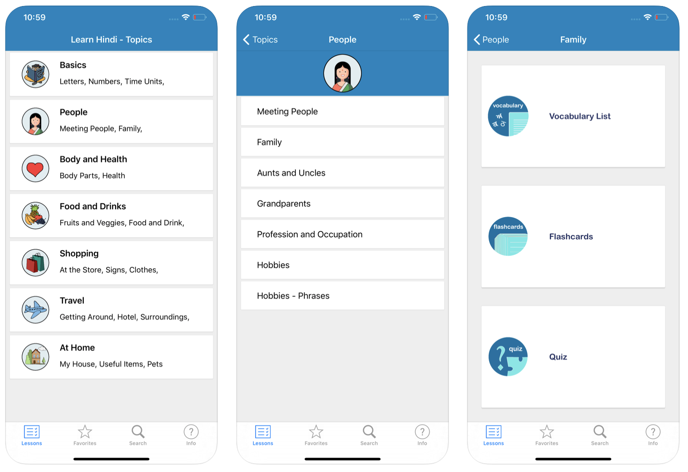
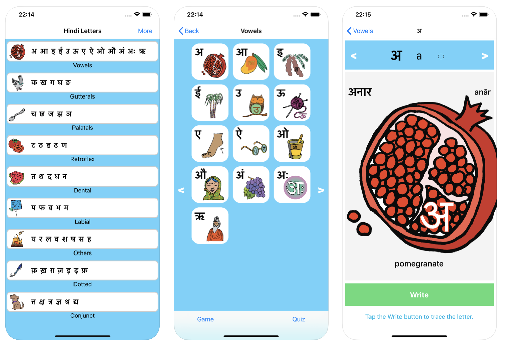
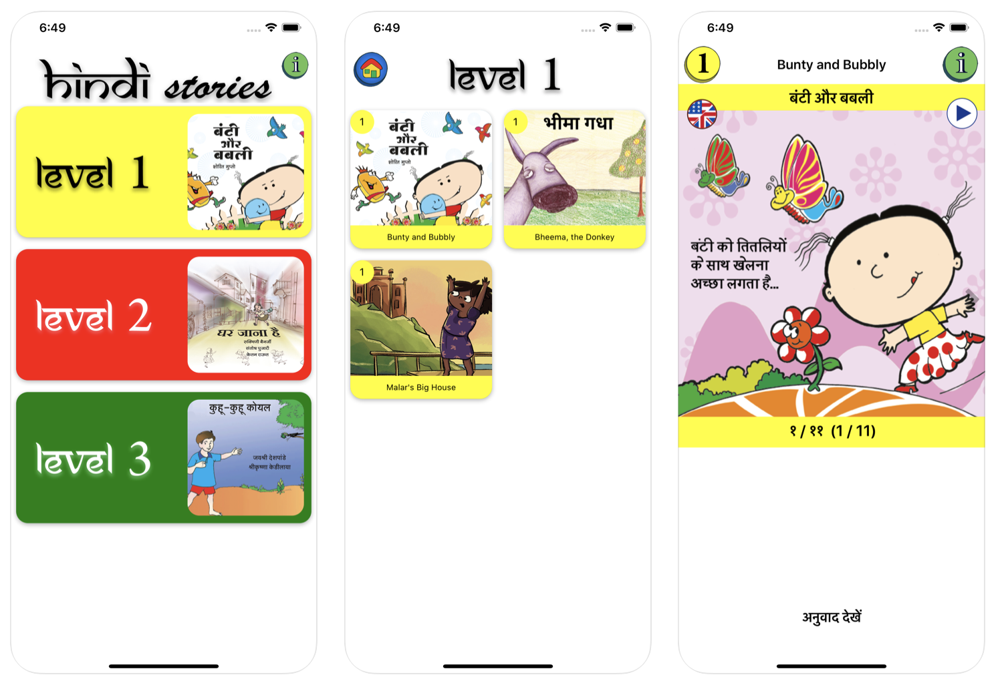
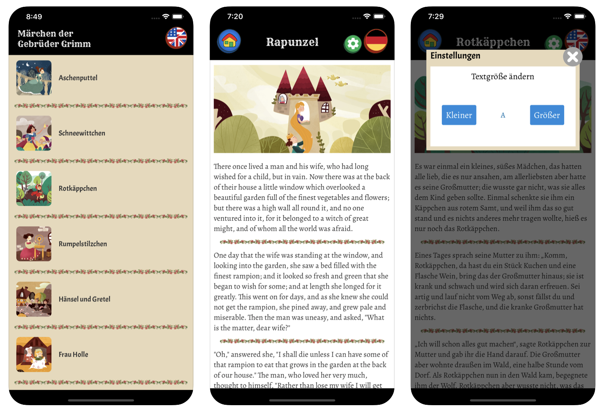

## Portfolio of Personal Apps

---

### Hindi Language Apps 

[Learn Hindi (iOS)](https://apps.apple.com/us/app/id325350528)

---
[Hindi Letters (iOS)](https://apps.apple.com/us/app/hindi-letters-devanagari/id1229546427)
 
[Hindi Letters (Android)](https://play.google.com/store/apps/details?id=com.cabhara.hindiletters)

---
[Stories in Hindi and English (iOS)](https://apps.apple.com/us/app/stories-in-hindi-and-english/id1458575435) 
 
[Stories in Hindi and English (Android)](https://play.google.com/store/apps/details?id=com.cabhara.hindistories)

---

### Other Apps

---
[Grimm Brothers' Fairy Tales - English and German (iOS)](https://apps.apple.com/us/app/grimm-brothers-fairy-tales/id1437206026)
 
[Grimm Brothers' Fairy Tales - English and German (Android)](https://play.google.com/store/apps/details?id=com.cabhara.grimms)

coming soon:
 
[Track My Expenses](http://example.com/)
 
Track your expenses - categorize, add images, view reports, reduce spending!
---

---

Page template forked from <a href="https://github.com/evanca/quick-portfolio">evanca</a>

<!-- Remove above link if you don't want to attibute -->
